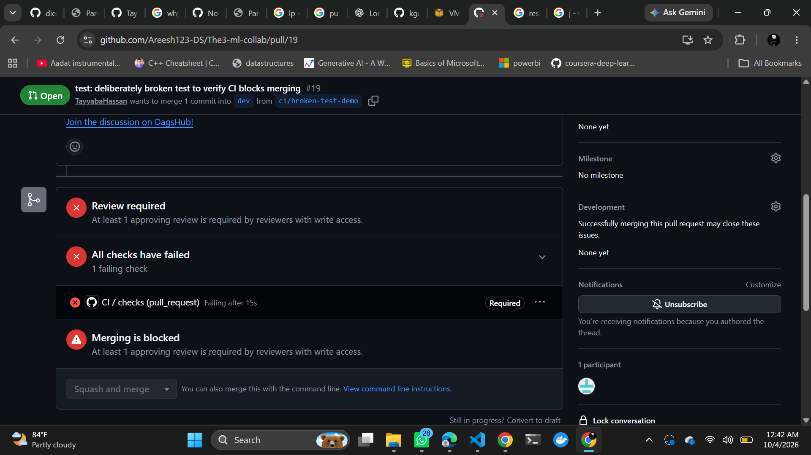
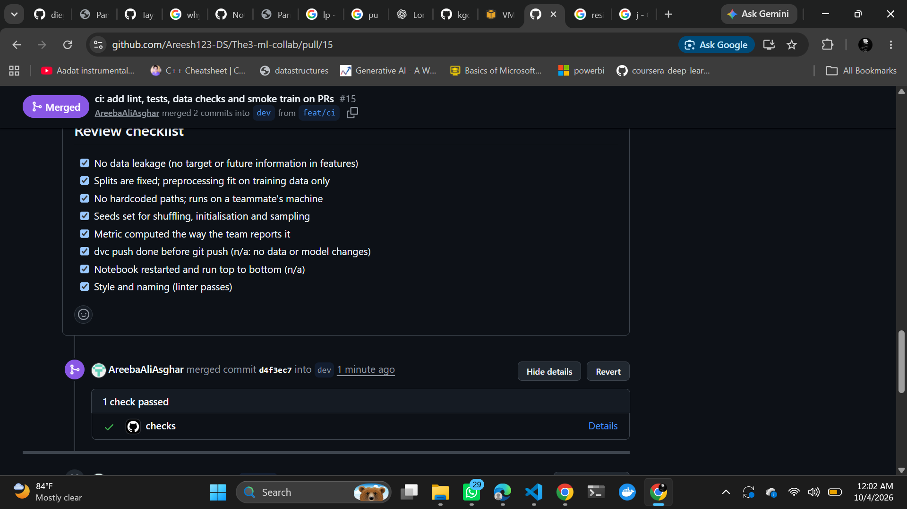

# REPORT: Git-Based Collaboration for an ML Project

Repository: https://github.com/Areesh123-DS/The3-ml-collab
Released model: tag `model-v1.0` on `main` (see [Release](#release-and-reproduction)).

## 1. Team, roles, dataset and starter code

| Member | GitHub | Role (Phase 1) |
|---|---|---|
| Tayyaba Hassan | TayyabaHassan | [TODO: role] |
| Areeba Ali (Asghar) | AreebaAliAsghar / AreebaAli | [TODO: role] |
| Areesha Riaz | Areesh123-DS | [TODO: role] |

- **Dataset:** California Housing, loaded with `sklearn.datasets.fetch_california_housing`. Source: https://scikit-learn.org/stable/datasets/real_world.html#california-housing-dataset
- **Target:** `MedHouseVal`. Rows with the $500k cap (`MedHouseVal >= 5.0`) are removed in `src/dataset.py` (PR #14). The raw file now has 19,648 rows, which is 992 fewer than the 20,640 in the original dataset. The PR #14 commit message says 965 rows; the count above is from the file.
- **Starter code:** adapted from the scikit-learn California Housing examples (credited in the docstring of `src/modeling/train.py`). [TODO: confirm this is the source the team used.]

## 2. Reproducibility table (released model)

The released model is the state of `dev` after PR #14, promoted to `staging` and `main` in Phase 9.

| Item | Value |
|---|---|
| Commit SHA (dev) | `cbcaea0` (PR #14, squash-merged) |
| `git_sha` recorded in metrics.json | `5232c4c` (pre-squash commit of PR #14; not in history after squash) |
| `params.yaml`: seed | 42 |
| `params.yaml`: split.test_size | 0.2 |
| `params.yaml`: model | random_forest |
| `params.yaml`: n_estimators | 200 |
| `params.yaml`: max_depth | 20 |
| Data `.dvc` hash (md5) | `13cd0156f310aa1b5a1c2eece9442e6b` (`data/raw/california_housing.csv`, 1,802,259 bytes) |
| Lock file | `dvc.lock` (stage hashes, including model md5 `6c8a5e967f93b8909db81b487cbef5e2`) |
| Final metrics | rmse 0.4639, mae 0.3098, r2 0.7755 |
| Reproduction by a non-trainer | [TODO: fill in from Phase 9 step 2] |

The dataset change in PR #14 changed the test set, so metrics before and after it are not directly comparable. The rows below marked "pre-#14" use the old data.

## 3. Experiments and why the winner was chosen

Each row is one `dvc exp run` or one PR's reported result. [TODO: paste `dvc exp show` output for each member's branch, and confirm the rows below.]

| Experiment | Hyperparameters | rmse | mae | r2 | Source |
|---|---|---|---|---|---|
| Baseline (depth 6) | max_depth=6, n=100 | 0.6483 | 0.4608 | 0.6793 | PR #7 (before) |
| Depth 15 | max_depth=15, n=100 | 0.51137 | 0.33312 | 0.80045 | PR #7 / PR #8 baseline |
| Depth search | max_depth=8, 10, 12, 20 | [TODO: from PR #7 description] | | | PR #7 |
| n_estimators 50 | max_depth=15, n=50 | 0.51229 | 0.33460 | 0.79973 | PR #8 |
| n_estimators 200 | max_depth=15, n=200 | 0.50944 | 0.33210 | 0.80195 | PR #8 |
| n_estimators 300 | max_depth=15, n=300 | 0.50890 | 0.33217 | 0.80237 | PR #8 |
| d20, n300 | max_depth=20, n=300 | 0.50400 | 0.32700 | 0.80620 | PR #9 |
| d25, n300 | max_depth=25, n=300 | 0.50410 | 0.32660 | 0.80610 | PR #9 |
| **d20, n500** | max_depth=20, n=500 | **0.50270** | **0.32620** | **0.80720** | PR #9 (winner of depth/trees search) |
| d20, n200 (pre-#14 data) | max_depth=20, n=200 | 0.50460 | 0.32710 | 0.80570 | PR #13 |
| d20, n200 (cleaned data) | max_depth=20, n=200 | 0.46394 | 0.30984 | 0.77550 | Final `dev` (PR #14) |

**Why the winner was chosen.** Among the depth and tree-count runs, d20 with n500 gave the best rmse, mae and r2. Depth 25 gave no further gain, so depth 20 was kept. The model with n500 was about 567 MB, which made DVC pushes and pulls slow. Since n200 is within about 0.002 rmse of n500 on the same data, the team reduced n_estimators to 200 (PR #13) to shrink the model. The final cleaned-data metrics come from PR #14.

## 4. Pull requests and process

| Area | Evidence |
|---|---|
| Data-update PR | PR #14: remove capped target rows (`data/` change tracked with DVC) |
| Conflict-resolution PR | PR #13: `n_estimators` 300 → 200 on top of #12, conflict with #12 resolved and documented in the description |
| "Changes requested" review | [TODO: find the PR with a "changes requested" review and link it] |
| Release PRs | [TODO: `release: v1.0` dev → staging, and staging → main] |
| Abandoned exp branch | [TODO: confirm; `exp/areeba-max-depth` is kept unmerged per the assignment] |
| Unmerged change to main (incident) | PR #10 (`n_estimators` 500 → 300) was merged into `main` instead of `dev`. Reverted on `main` by PR #11. See section 6. |

## 5. Screenshots

- Blocked large file or secret (Phase 3 checkpoint). Commit attempted on a scratch branch with a 2 MB file and a fake AWS access key; both were blocked by pre-commit and no commit was created:

  ```
  check for added large files..............................................Failed
  - hook id: check-added-large-files
  - exit code: 1

  scratch_big_file.bin (2048 KB) exceeds 1024 KB.

  Detect secrets...........................................................Failed
  - hook id: detect-secrets
  - exit code: 1

  ERROR: Potential secrets about to be committed to git repo!

  Secret Type: AWS Access Key
  Location:    scratch_secret.txt:2
  ```
- Failing CI check, with merge blocked by the required `CI / checks (pull_request)` status (Phase 8 checkpoint; PR #19, deliberately broken test, branch deleted afterwards):

  

- Passing CI check (PR #15, `feat/ci`, merged into `dev`):

  

## 6. Retrospective

What broke:
- PR #10 was opened against `main` by default, so the change skipped `dev` and `staging`. Reverted in PR #11.
- A `dvc push` to DagsHub timed out during a 340–567 MB model push, which blocked the first attempt at PR #12.
- A stale DVC lock file blocked `dvc pull` after an interrupted command. Cleared by deleting the lock files in `.dvc/tmp/`.
- The PR #14 commit message count (965) did not match the rows actually removed (992).

What we added to CONTRIBUTING.md because of it: [TODO: confirm what the team agrees to add]

## 7. Individual contributions

- **Tayyaba Hassan:** [TODO: own words] Authored PRs #8, #10 (incident), #12. Reviewed and merged PR #7. Ran the `n_estimators` experiments (50, 200, 300) for PR #8. Checked PRs #9, #12 and #13 locally (reproduction, tests, pre-commit) before review.
- **Areeba Ali (Asghar):** [TODO: own words] Authored PRs #4, #5, #6, #7 and #13. Reviewed and merged PR #10. Wrote the README and CONTRIBUTING.md scaffold.
- **Areesha Riaz:** [TODO: own words] Authored PRs #1, #2, #3, #9 and #14. Set up the pre-commit hooks, DVC data tracking, the EDA notebook, and the data cleaning step.

Each paragraph above lists what the git history shows. Each member should rewrite their paragraph in their own words, and should check the PR counts before submitting.
