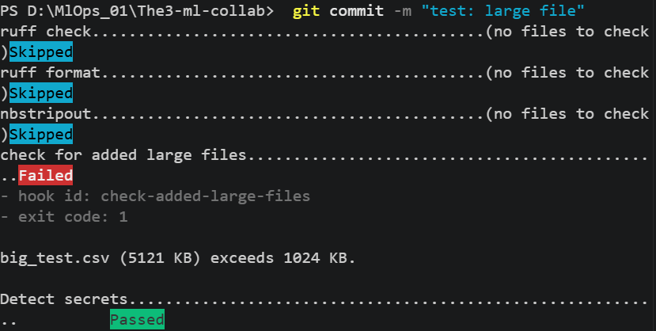
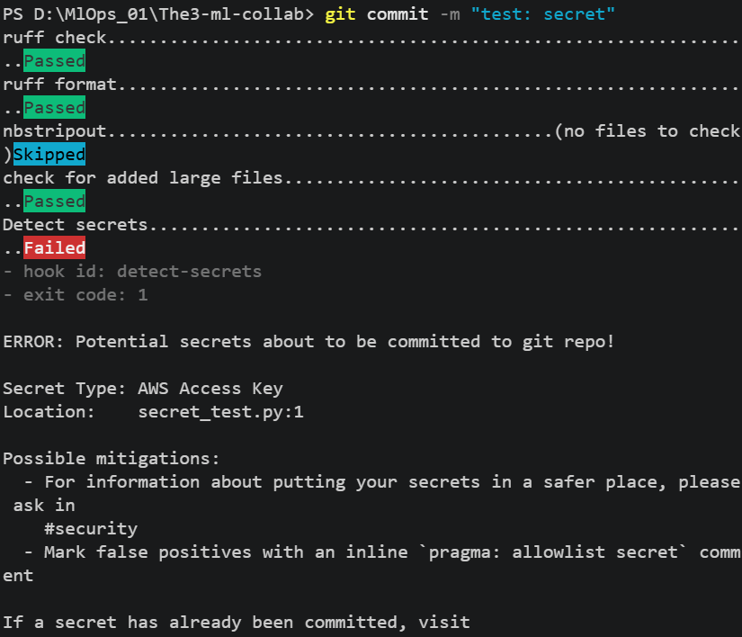
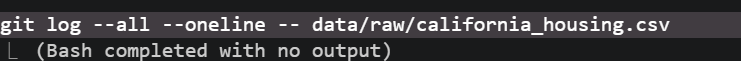
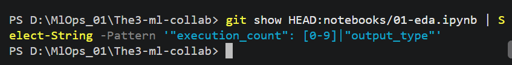
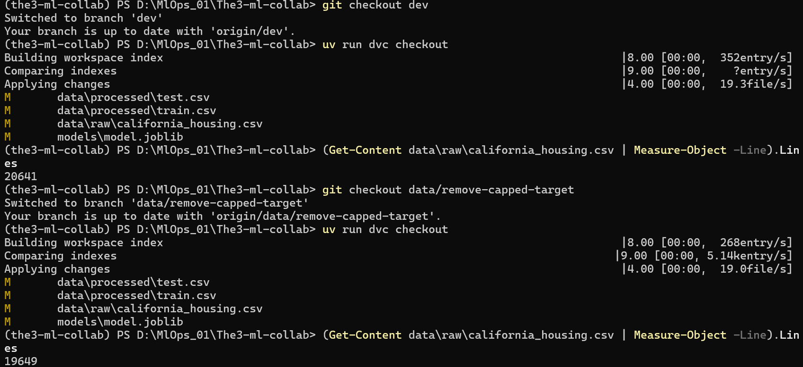
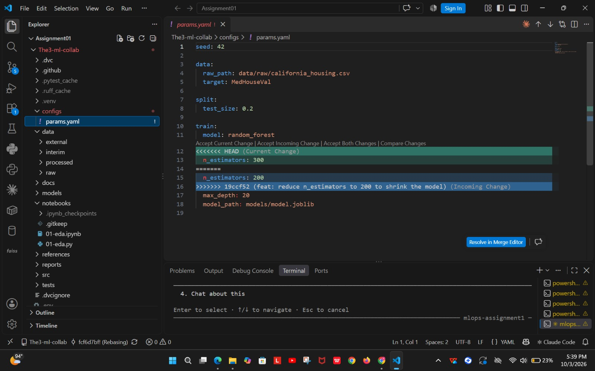
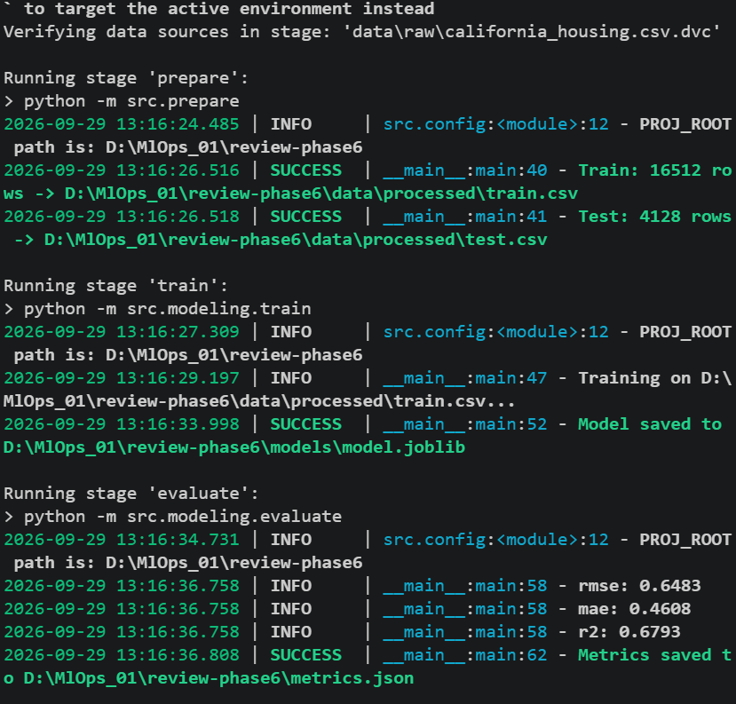
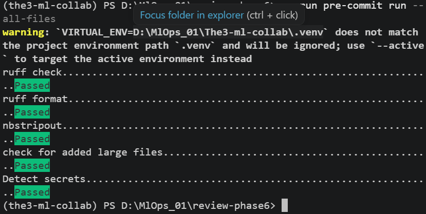
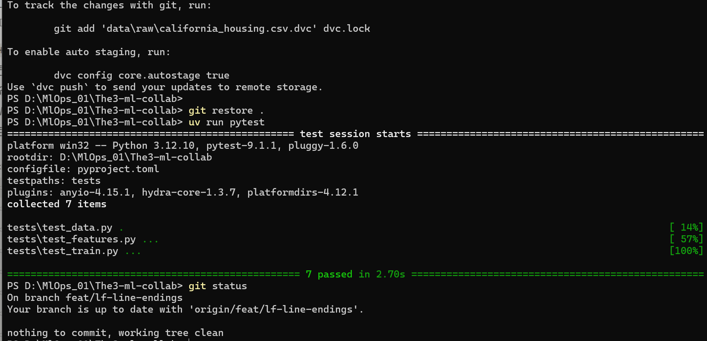
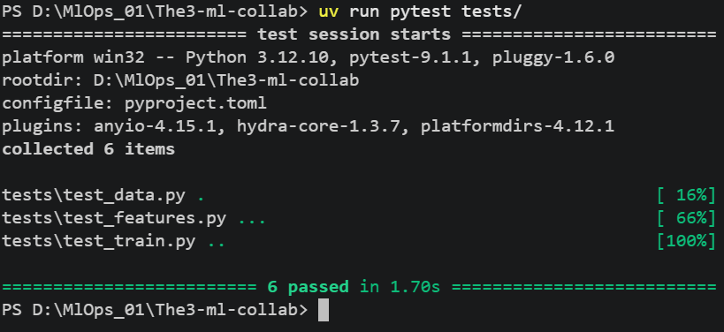

# REPORT: Git-Based Collaboration for an ML Project

Repository: https://github.com/Areesh123-DS/The3-ml-collab
Released model: tag `model-v1.0` on `main` (see [section 2](#2-reproducibility-table-released-model)).

## 1. Team, roles, dataset and starter code

| Member | GitHub | Role (Phase 1) |
|---|---|---|
| Tayyaba Hassan | TayyabaHassan | Platform owner |
| Areeba Ali (Asghar) | AreebaAliAsghar | Model owner |
| Areesha Riaz | Areesh123-DS | Data owner |

- **Dataset:** California Housing, loaded with `sklearn.datasets.fetch_california_housing`. Source: https://scikit-learn.org/stable/datasets/real_world.html#california-housing-dataset
- **Target:** `MedHouseVal`. Rows with the $500k cap (`MedHouseVal >= 5.0`) are removed in `src/dataset.py` (PR #14). The raw file now has 19,648 rows, which is 992 fewer than the 20,640 in the original dataset. The PR #14 commit message says 965 rows; the count above is from the file.
- **Starter code:** adapted from the scikit-learn California Housing examples (credited in the docstring of `src/modeling/train.py`). [TODO (Areeba): confirm the dataset and starter-code source and add the link.]

## 2. Reproducibility table (released model)

The released model is the state of `dev` after PR #18, promoted to `staging` in [#20](https://github.com/Areesh123-DS/The3-ml-collab/pull/20) and to `main` in [#21](https://github.com/Areesh123-DS/The3-ml-collab/pull/21).

| Item | Value |
|---|---|
| Commit SHA | `44a3778`, tag `model-v1.0` on `main` |
| `git_sha` recorded in metrics.json | `d4f3ec7` (re-logged on committed code in [#18](https://github.com/Areesh123-DS/The3-ml-collab/pull/18); no code, params or data changes between `d4f3ec7` and `44a3778`) |
| `params.yaml`: seed | 42 |
| `params.yaml`: split.test_size | 0.2 |
| `params.yaml`: model | random_forest |
| `params.yaml`: n_estimators | 200 |
| `params.yaml`: max_depth | 20 |
| Data `.dvc` hash (md5) | `13cd0156f310aa1b5a1c2eece9442e6b` (`data/raw/california_housing.csv`, 1,802,259 bytes) |
| Lock file | `dvc.lock` (stage hashes, including model md5 `6c8a5e967f93b8909db81b487cbef5e2`) |
| Final metrics | rmse 0.4639, mae 0.3098, r2 0.7755 |
| Reproduction by a non-trainer | TayyabaHassan, fresh clone on [#20](https://github.com/Areesh123-DS/The3-ml-collab/pull/20): identical metrics |

`model-v1.0` (`44a3778`) is the released and reproduced model. The later merge into `main` only adds `REPORT.md` and `CONTRIBUTING.md` updates (no code, params, data or model changes), so it is not tagged as a new model version.

The dataset change in PR #14 changed the test set, so metrics before and after it are not directly comparable. The rows below marked "pre-#14" use the old data.

## 3. Experiments and why the winner was chosen

Each row is one `dvc exp run` or one PR's reported result.

| Experiment | Hyperparameters | rmse | mae | r2 | Source |
|---|---|---|---|---|---|
| Baseline (depth 6) | max_depth=6, n=100 | 0.6483 | 0.4608 | 0.6793 | PR #7 (before) |
| Depth 15 | max_depth=15, n=100 | 0.51137 | 0.33312 | 0.80045 | PR #7 / PR #8 baseline |
| md-8 | max_depth=8, n=100 | 0.58552 | 0.40260 | 0.73838 | PR #7 |
| md-10 | max_depth=10, n=100 | 0.54448 | 0.36632 | 0.77377 | PR #7 |
| md-12 | max_depth=12, n=100 | 0.52314 | 0.34594 | 0.79115 | PR #7 |
| md-20 | max_depth=20, n=100 | 0.50625 | 0.32807 | 0.80442 | PR #7 |
| n_estimators 50 | max_depth=15, n=50 | 0.51229 | 0.33460 | 0.79973 | PR #8 |
| n_estimators 200 | max_depth=15, n=200 | 0.50944 | 0.33210 | 0.80195 | PR #8 |
| n_estimators 300 | max_depth=15, n=300 | 0.50890 | 0.33217 | 0.80237 | PR #8 |
| d20, n300 | max_depth=20, n=300 | 0.50400 | 0.32700 | 0.80620 | PR #9 |
| d25, n300 | max_depth=25, n=300 | 0.50410 | 0.32660 | 0.80610 | PR #9 |
| **d20, n500** | max_depth=20, n=500 | **0.50270** | **0.32620** | **0.80720** | PR #9 (winner of depth/trees search) |
| d20, n200 (pre-#14 data) | max_depth=20, n=200 | 0.50460 | 0.32710 | 0.80570 | PR #13 |
| d20, n200 (cleaned data) | max_depth=20, n=200 | 0.46394 | 0.30984 | 0.77550 | Final `dev` (PR #14) |

In PR #7, depth 15 was chosen over 20 because of diminishing returns.

`dvc exp show --md --only-changed` on `exp/areesha-depth-trees`:

| Experiment | rmse | mae | r2 | git_sha | train.n_estimators | train.max_depth |
|---|---|---|---|---|---|---|
| exp/areesha-depth-trees (baseline) | 0.5089 | 0.33217 | 0.80237 | e16c714 | 300 | 15 |
| ├── d25-n300 | 0.50405 | 0.32663 | 0.80611 | 6a9f959 | 300 | 25 |
| ├── **d20-n500** | **0.50269** | **0.32617** | **0.80716** | 6a9f959 | 500 | 20 |
| └── d20-n300 | 0.50397 | 0.32702 | 0.80618 | 6a9f959 | 300 | 20 |

Experiments on `exp/tayyaba-n-estimators` (max_depth=15), as reported in [#8](https://github.com/Areesh123-DS/The3-ml-collab/pull/8):

| Experiment | n_estimators | rmse | mae | r2 |
|---|---|---|---|---|
| baseline | 100 | 0.51137 | 0.33312 | 0.80045 |
| n-estimators-50 | 50 | 0.51229 | 0.33460 | 0.79973 |
| n-estimators-200 | 200 | 0.50944 | 0.33210 | 0.80195 |
| **n-estimators-300** | **300** | **0.50890** | **0.33217** | **0.80237** |

`n_estimators=300` gave the best rmse and r2, with diminishing gains between 200 and 300, so it was promoted in #8.

**Why the winner was chosen.** Among the depth and tree-count runs, d20 with n500 gave the best rmse, mae and r2. Depth 25 gave no further gain, so depth 20 was kept. The model with n500 was about 567 MB, which made DVC pushes and pulls slow. Since n200 is within about 0.002 rmse of n500 on the same data, the team reduced n_estimators to shrink the model (500 → 300 in #12, then 300 → 200 in #13). The final cleaned-data metrics come from PR #14.

## 4. Pull requests and process

| Area | Evidence |
|---|---|
| Data-update PR | [#14](https://github.com/Areesh123-DS/The3-ml-collab/pull/14): remove capped target rows (`data/` change tracked with DVC) |
| Conflict-resolution PR | [#13](https://github.com/Areesh123-DS/The3-ml-collab/pull/13): `n_estimators` 300 → 200 on top of #12, conflict with #12 resolved and documented in the description (screenshot in section 5) |
| "Changes requested" review | [AreebaAliAsghar's review on #14](https://github.com/Areesh123-DS/The3-ml-collab/pull/14#pullrequestreview-5401434267) |
| Release PRs | [#20](https://github.com/Areesh123-DS/The3-ml-collab/pull/20) (`dev` → `staging`) and [#21](https://github.com/Areesh123-DS/The3-ml-collab/pull/21) (`staging` → `main`) |
| Abandoned exp branch | [`exp/areeba-bedroom-ratio`](https://github.com/Areesh123-DS/The3-ml-collab/tree/exp/areeba-bedroom-ratio): adding a BedroomRatio feature on d20/n500 lowered r2 from 0.8072 to 0.8062 and raised rmse from 0.5027 to 0.5039. The ratio is built from two features the forest already uses, so it added nothing and the branch was never merged. |
| Unmerged change to main (incident) | [#10](https://github.com/Areesh123-DS/The3-ml-collab/pull/10) (`n_estimators` 500 → 300) was merged into `main` instead of `dev`. Reverted on `main` by [#11](https://github.com/Areesh123-DS/The3-ml-collab/pull/11). See section 6. |

## 5. Screenshots

- Blocked large file (Phase 3 checkpoint): a 5 MB file was rejected by `check-added-large-files`.

  

- Blocked secret (Phase 3 checkpoint): a fake AWS access key was rejected by `detect-secrets`.

  

- CSV not in Git history (Phase 4 checkpoint): `git log --all` on the CSV path returns nothing; only its `.dvc` pointer is tracked.

  

- Notebook outputs stripped (Phase 5 checkpoint): the committed notebook has no execution counts or outputs.

  

- Switching data versions (Phase 7, step 4): `git checkout` + `dvc checkout` moves between the old data (20,640 rows) and the cleaned data (19,648 rows).

  

- Resolving a real conflict (Phase 7, step 5): while rebasing PR #13 on `dev`, `configs/params.yaml` conflicted on the same line changed by #12 (`n_estimators: 300` on `dev` vs `n_estimators: 200` on the branch). The conflict was resolved by keeping 200.

  

- Review of PR #4 (Phase 6 pipeline): fresh clone, `dvc repro` runs end to end, and all pre-commit hooks pass.

  
  

- Review of PR #5 (LF line endings): tests pass on the branch and the working tree stays clean.

  

- Unit tests passing:

  

- Failing CI check, with merge blocked by the required `CI / checks (pull_request)` status (Phase 8 checkpoint; PR #19, deliberately broken test, branch deleted afterwards):

  

- Passing CI check (PR #15, `feat/ci`, merged into `dev`):

  

## 6. Retrospective

What broke:
- PR #10 was opened against `main` by default, so the change skipped `dev` and `staging`. Reverted in PR #11.
- A `dvc push` to DagsHub timed out during a 340–567 MB model push, which blocked the first attempt at PR #12.
- A stale DVC lock file blocked `dvc pull` after an interrupted command. Cleared by deleting the lock files in `.dvc/tmp/`.
- The PR #14 commit message count (965) did not match the rows actually removed (992).
- PRs #12, #13 and #14 ran `dvc repro` before committing, so `metrics.json` logged a SHA that did not contain the exact code or params. Fixed in #18 by re-running the pipeline on committed code.
- The report PR used a `docs/` branch, which is not one of our allowed prefixes (`feat/`, `data/`, `exp/`, `fix/`). Future documentation changes go on a `feat/` branch.

What we added to CONTRIBUTING.md because of it:
- Check the PR base branch before creating it (after #10 went to `main`).
- `CI / checks` is a required status check on `dev`, `staging` and `main`.
- After a squash merge, re-run the evaluate stage on a branch from `dev` and open a PR, so `git_sha` matches the code (after #12–#14 logged stale SHAs).
- Recovery notes: `dvc push --jobs 1` on timeouts, and taking counts in commit messages from the data rather than from memory.

## 7. Individual contributions

- **Tayyaba Hassan (Platform owner):** I ran the `n_estimators` experiments (50, 200 and 300 trees) and promoted 300 (#8), then later brought the tree count back down to keep the model smaller (#12). I set up CI with lint, tests, data checks and a smoke train on every PR (#15), and showed with a deliberately broken test that a failing check blocks merging (#16, #17, #19). For the release, I opened both release PRs (#20, #21), ran the reproducibility test on a fresh clone and got identical metrics. I also wrote the first draft of this report and the retrospective (#22). I reviewed #7, #9 and #13.
- **Areeba Ali (Asghar) (Model owner):** [TODO (Areeba): rewrite in your own words] Authored PRs #4, #5, #6, #7 and #13. Reviewed and merged PR #10. Wrote the README and CONTRIBUTING.md scaffold.
- **Areesha Riaz (Data owner):** I created the repository and made the CI check required on `dev`, `staging` and `main`. I set up the pre-commit hooks (#1), put the dataset under DVC (#2) and made the EDA notebook (#3). For experiments, I tried three combinations of tree depth and number of trees and promoted the best one (#9). As Data owner, I removed the 992 rows with capped house prices and moved that cleaning step into code with a test (#14); a teammate requested changes on this PR and I fixed all of them. I also re-ran the pipeline so `metrics.json` records the correct commit (#18). I reviewed #4, #5, #6, #11, the two release PRs (#20, #21) and the report PR (#22).

Each paragraph above lists what the git history shows. Each member should rewrite their paragraph in their own words, and should check the PR counts before submitting.
